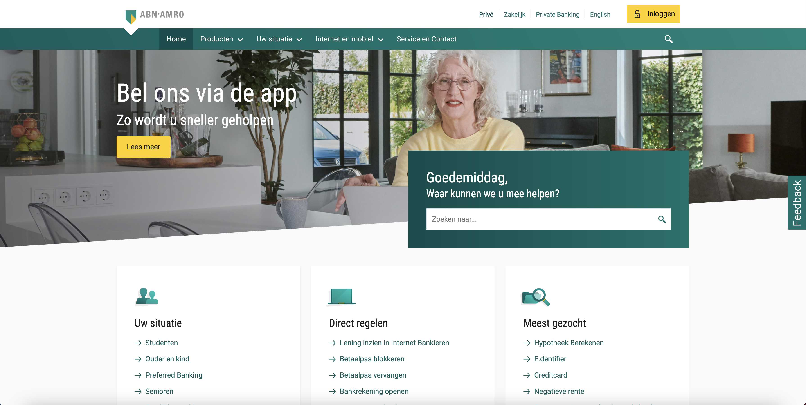
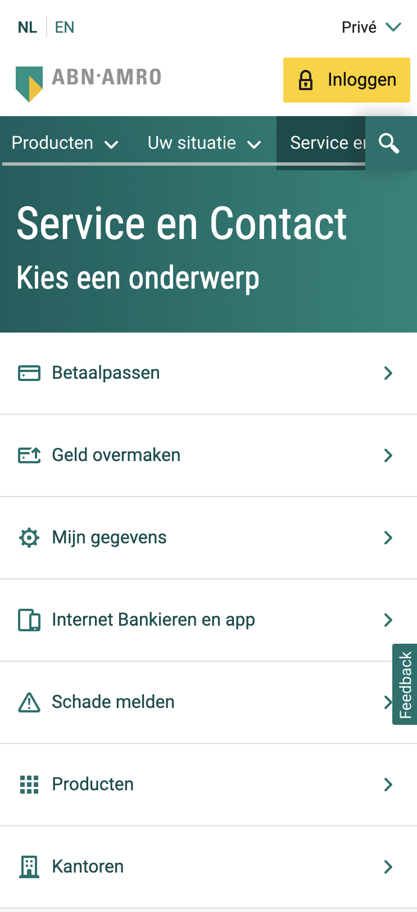
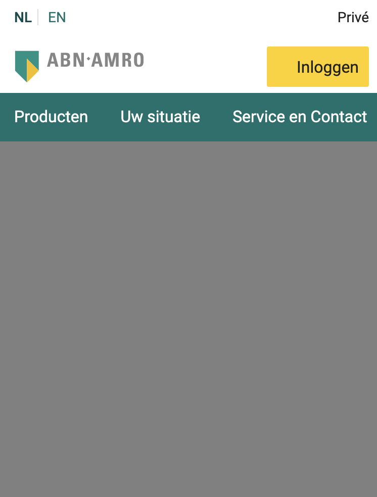
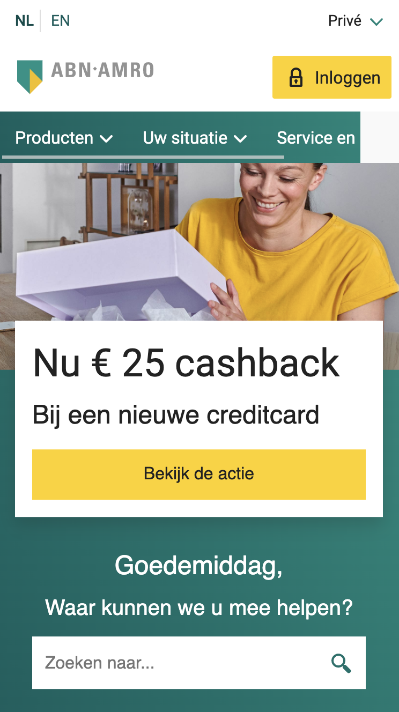

# Procesverslag
Markdown is een simpele manier om HTML te schrijven.  
Markdown cheat cheet: [Hulp bij het schrijven van Markdown](https://github.com/adam-p/markdown-here/wiki/Markdown-Cheatsheet).

Nb. De standaardstructuur en de spartaanse opmaak van de README.md zijn helemaal prima. Het gaat om de inhoud van je procesverslag. Besteedt de tijd voor pracht en praal aan je website.

Nb. Door *open* toe te voegen aan een *details* element kun je deze standaard open zetten. Fijn om dat steeds voor de relevante stuk(ken) te doen.

## Jij

uitwerken voor kick-off werkgroep

### Auteur:
Coen Janssen 

#### Je startniveau:
Rood - Het blijft leuk om uitdaging te zoeken, maar vind het soms nog lastig.

#### Je focus:
Surface Plane
 

## Je website

uitwerken voor kick-off werkgroep

### Je opdracht:
De uitdaging voor mij wordt om de homepage van de ABN AMRO Bank na te maken.
URL: https://www.abnamro.nl/nl/prive/index.html

#### Screenshot(s) van de eerste pagina (small screen): 
ABN AMRO Bank: Prive / Home

#### Screenshot(s) van de tweede pagina (small screen):
ABN AMRO Bank: Prive / Service en contact

 

## Breakdownschets (week 1)

uitwerken na afloop 2e werkgroep

NOTE: DEZE NOG TOEVOEGEN
### de hele pagina: 

### dynamisch deel (bijv menu): 

### wellicht nog een dynamisch deel (bijv filter): 

## Voortgang 1 (week 2)

uitwerken voor 1e voortgang

### Stand van zaken
Voor de eerste voorgang ben ik, mede dankzij de lesstof, goed op weg met mijn website. 
Ik beschik over een beginner kennis en kom er op een paar uitzonderingen na erg goed uit
door middel van element inspecteren en te vergelijken met hoe de huidige website van de
ABN AMRO er uitziet en opgebouwd is - deels van deze informatie kan ik goed gebruiken.

De focus heb ik de afgelopen tijd gelegd op het proberen na te maken van de ABN AMRO site,
dit naast het volgen van de werkgroepen en hier en daar wat oefeningen. De site van de ABN
AMRO zit voor mij vol met uitdagende elementen om na te maken, met name in de navigatie. 
Hier ben ik dan ook als eerste mee aan de slag gegaan, met af en toe wat struggles. 

Gelukkig kan ik bij medestudenten terecht om af en toe wat lastige knelpunten mee te bespreken
en uit te vogelen hoe het precies zit. Daarnaast moet ik de komende week proberen om mijn
code weer wat op te schonen betreft CSS. Hier en daar wat annotaties toevoegen kan ook geen
kwaad. Maar al met al ben ik denk ik goed op weg en kan ik volgende week de eerste pagina af hebben.

### Agenda voor meeting
samen met je groepje opstellen

| Adam           | Danian          | Shae           | Coen (ikzelf)    |
| ---            | ---             | ---            | ---              |
| Geen 		     | Geen            | Geen           | Geen             |
| Bijzonderheden | Bijzonderheden  | Bijzonderheden | Bijzonderheden   |
| ...            | ...             | ...            | ...              |

### Verslag van meeting
hier na afloop snel de uitkomsten van de meeting vastleggen

- Je maakt goed gebruik van de "selectors" binnen CSS, voeg wellicht nog wat annotaties toe.
- Probeer vooruit te denken binnen de HTML, vul deze eerst en ga daarna pas stylen.
- Werk op je pagina van boven naar beneden, om overzicht te bewaren.
- Maak van de eerste drie <SECTION>'s een <NAV>, binnen die navigatie komt drie keer een <UL>.
- Maak backups van je website, zodat je styling en andere elementen terug kunt vinden.

## Voortgang 2 (week 3)

uitwerken voor 2e voortgang

### Stand van zaken
Voor deze tweede voortgang ben ik al heel erg opgeschoten met mijn code voor de homepage. 
Deze week had ik de motivatie goed te pakken nadat ik eindelijk het voor elkaar had gekregen
om de navigatie te maken zoals die gelijk is aan die van de ABN AMRO. Er hangt hierbij nog 
een vraag in de lucht en dat is in de <NAV> het search icoon, hoe deze in de HTML moet.

Ik kom er wel uit hoe dit icoon geplaatst en gepositioneerd moet worden, alleen niet hoe ik
dit op de beste manier in de HTML kan plaatsen en vervolgens stylen met de CSS. Deze vraag
wil ik graag tijdens mijn voortgang bespreken. Ik heb dit overigens al wel in de les aangegeven
en met de oplossing die uit de les bleek is het mij helaas niet gelukt. 

Over de website en status van hoe ver ik momenteel ben, ben ik erg tevreden. Ik vindt dat het
best goed gaat om alles 1-op-1 na te maken met de huidige site. Hier en daar misschien wat 
verschillende marges en het font wijkt ook iets af, maar verder ziet het er goed uit. De focus nu 
is het afronden van de homepage en een start te gaan maken aan de tweede pagina, daarna animaties e.d.

### Agenda voor meeting
samen met je groepje opstellen

| Adam           | Danian          | Shae           | Coen (ikzelf)    |
| ---            | ---             | ---            | ---              |
| Geen 		     | Geen            | Geen           | Geen             |
| Bijzonderheden | Bijzonderheden  | Bijzonderheden | Bijzonderheden   |
| ...            | ...             | ...            | ...              |

### Verslag van meeting
hier na afloop snel de uitkomsten van de meeting vastleggen

- punt 1
- punt 2
- nog een punt
- ...

## Toegankelijkheidstest (week 4)

uitwerken na test in 8e voortgang

### Bevindingen
Lijst met je bevindingen die in de test naar voren kwamen:

#### Titel eerste bevinding
Hier korte omschrijving (met indien nodig een afbeelding)

Hier een omschrijving van hoe het opgelost kan worden (met indien nodig een afbeelding)

#### Titel tweede bevinding. 
Hier korte omschrijving (met indien nodig een afbeelding)

Hier een omschrijving van hoe het opgelost kan worden (met indien nodig een afbeelding)

#### Titel volgende bevinding. 
Hier korte omschrijving (met indien nodig een afbeelding)

Hier een omschrijving van hoe het opgelost kan worden (met indien nodig een afbeelding)

#### Titel nog een bevinding. 
Hier korte omschrijving (met indien nodig een afbeelding)

Hier een omschrijving van hoe het opgelost kan worden (met indien nodig een afbeelding)

## Voortgang 3 (week 4)

uitwerken voor 3e voortgang

### Stand van zaken
hier dit ging goed & dit was lastig (neem ook screenshots op van delen van je website en code)

### Agenda voor meeting
samen met je groepje opstellen

| student 1      | student 2          | student 3    | student 4        |
| ---            | ---                | ---          | ---              |
| dit bespreken  | en dit             | en ik dit    | en dan ik dat    |
| en dat ook nog | dit als er tijd is | nog een punt | dit wil ik zeker |
| ...            | ...                | ...          | ...              |

### Verslag van meeting
hier na afloop snel de uitkomsten van de meeting vastleggen

- punt 1
- punt 2
- nog een punt
- ...

## Eindgesprek (week 5)

uitwerken voor eindgesprek

### Stand van zaken
hier dit ging goed & dit was lastig (neem ook screenshots op van delen van je website en code)

### Screenshot(s)

hier screenshot(s) van je eindresultaat

## Bronnenlijst

continu bijhouden terwijl je werkt

Nb. Wees specifiek ('css-tricks' als bron is bijv. niet specifiek genoeg).

1. bron 1
2. bron 2
3. ...

