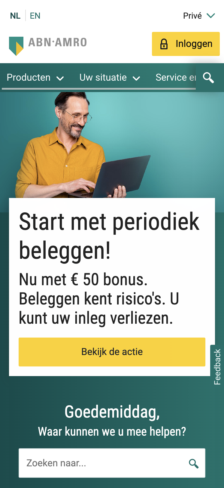
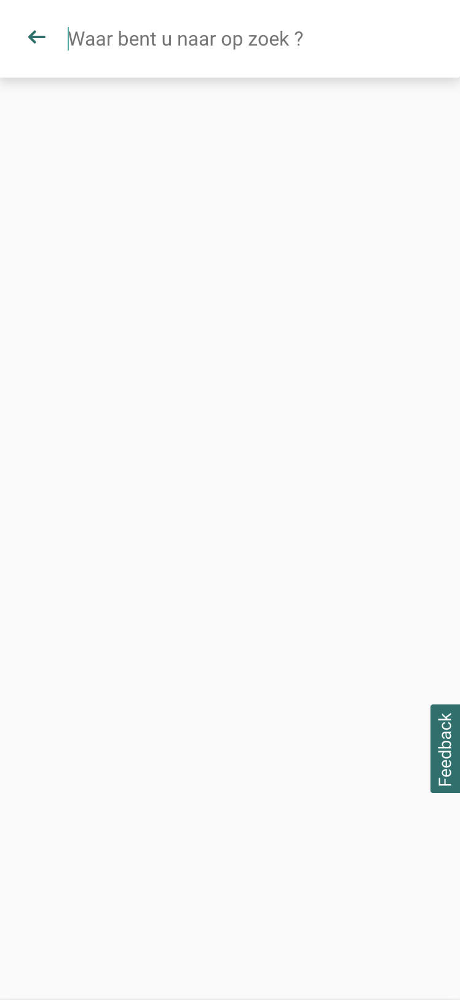

# Procesverslag
Markdown is een simpele manier om HTML te schrijven.  
Markdown cheat cheet: [Hulp bij het schrijven van Markdown](https://github.com/adam-p/markdown-here/wiki/Markdown-Cheatsheet).

Nb. De standaardstructuur en de spartaanse opmaak van de README.md zijn helemaal prima. Het gaat om de inhoud van je procesverslag. Besteedt de tijd voor pracht en praal aan je website.

Nb. Door *open* toe te voegen aan een *details* element kun je deze standaard open zetten. Fijn om dat steeds voor de relevante stuk(ken) te doen.

## Jij

uitwerken voor kick-off werkgroep

### Auteur:
Coen Janssen 

#### Je startniveau:
Rood - Het blijft leuk om uitdaging te zoeken, maar vind het meestal nog erg lastig.

#### Je focus:
Surface Plane
 

## Je website

uitwerken voor kick-off werkgroep

### Je opdracht:
De uitdaging voor mij wordt om de homepage van de ABN AMRO Bank na te maken.
URL: https://www.abnamro.nl/nl/prive/index.html

#### Screenshot(s) van de eerste pagina (small screen): 
ABN AMRO Bank: Prive / Home

#### Screenshot(s) van de tweede pagina (small screen):
ABN AMRO Bank: Prive / Service en contact

 

## Breakdownschets (week 1)

uitwerken na afloop 2e werkgroep

### de hele pagina: 
Ik heb geprobeerd om een breakdownschets te maken voordat ik startte met de website.
Hierdoor zijn sommige elementen in het eindproduct anders uitgewerkt. 

### dynamisch deel (bijv menu): 
Deze zoekfunctie is dynamisch doordat je op een "search-icon" klikt en dit venster
van rechts naar links het beeld in schuift. Hiervoor maak ik gebruik van een input. 

### wellicht nog een dynamisch deel (bijv filter): 
In de officiele website is dit een dynamisch deel. Deze heb ik niet als breakdown-schets 
uitgewerkt omdat ik deze alleen uit zal werken wanneer daar tijd voor over is. 

## Voortgang 1 (week 2)

uitwerken voor 1e voortgang

### Stand van zaken
Voor de eerste voorgang ben ik, mede dankzij de lesstof, goed op weg met mijn website. 
Ik beschik over een beginner kennis en kom er op een paar uitzonderingen na erg goed uit
door middel van element inspecteren en te vergelijken met hoe de huidige website van de
ABN AMRO er uitziet en opgebouwd is - deels van deze informatie kan ik goed gebruiken.

De focus heb ik de afgelopen tijd gelegd op het proberen na te maken van de ABN AMRO site,
dit naast het volgen van de werkgroepen en hier en daar wat oefeningen. De site van de ABN
AMRO zit voor mij vol met uitdagende elementen om na te maken, met name in de navigatie. 
Hier ben ik dan ook als eerste mee aan de slag gegaan, met af en toe wat struggles. 

Gelukkig kan ik bij medestudenten terecht om af en toe wat lastige knelpunten mee te bespreken
en uit te vogelen hoe het precies zit. Daarnaast moet ik de komende week proberen om mijn
code weer wat op te schonen betreft CSS. Hier en daar wat annotaties toevoegen kan ook geen
kwaad. Maar al met al ben ik denk ik goed op weg en kan ik volgende week de eerste pagina af hebben.

### Agenda voor meeting
samen met je groepje opstellen

| Adam           | Danian          | Shae           | Coen (ikzelf)    |
| ---            | ---             | ---            | ---              |
| Geen 		     | Geen            | Geen           | Geen             |
| Bijzonderheden | Bijzonderheden  | Bijzonderheden | Bijzonderheden   |
| ...            | ...             | ...            | ...              |

### Verslag van meeting
hier na afloop snel de uitkomsten van de meeting vastleggen

- Je maakt goed gebruik van de "selectors" binnen CSS, voeg wellicht nog wat annotaties toe.
- Probeer vooruit te denken binnen de HTML, vul deze eerst en ga daarna pas stylen.
- Werk op je pagina van boven naar beneden, om overzicht te bewaren.
- Maak van de eerste drie SECTION's een NAV, binnen die navigatie komt drie keer een UL.
- Maak backups van je website, zodat je styling en andere elementen terug kunt vinden.

## Voortgang 2 (week 3)

uitwerken voor 2e voortgang

### Stand van zaken
Voor deze tweede voortgang ben ik al heel erg opgeschoten met mijn code voor de homepage. 
Deze week had ik de motivatie goed te pakken nadat ik eindelijk het voor elkaar had gekregen
om de navigatie te maken zoals die gelijk is aan die van de ABN AMRO. Er hangt hierbij nog 
een vraag in de lucht en dat is in de <NAV> het search icoon, hoe deze in de HTML moet.

Ik kom er wel uit hoe dit icoon geplaatst en gepositioneerd moet worden, alleen niet hoe ik
dit op de beste manier in de HTML kan plaatsen en vervolgens stylen met de CSS. Deze vraag
wil ik graag tijdens mijn voortgang bespreken. Ik heb dit overigens al wel in de les aangegeven
en met de oplossing die uit de les bleek is het mij helaas niet gelukt. 

Over de website en status van hoe ver ik momenteel ben, ben ik erg tevreden. Ik vindt dat het
best goed gaat om alles 1-op-1 na te maken met de huidige site. Hier en daar misschien wat 
verschillende marges en het font wijkt ook iets af, maar verder ziet het er goed uit. De focus nu 
is het afronden van de homepage en een start te gaan maken aan de tweede pagina, daarna animaties e.d.

### Agenda voor meeting
samen met je groepje opstellen

| Adam           | Danian          | Shae           | Coen (ikzelf)    |
| ---            | ---             | ---            | ---              |
| Responsive controleren 		     | Uitwerking socials           | Formulier beter laten schalen          | Footer maken & search button toevoegen             |
|  |   |  |    |
| ...            | ...             | ...            | ...              |

### Verslag van meeting
hier na afloop snel de uitkomsten van de meeting vastleggen

- Beginnen aan de tweede pagina.
- De grootste issue (search button) is opgelost. 
- De footer is uiteindelijk zelf gelukt om op te lossen.

## Toegankelijkheidstest (week 4)

uitwerken na test in 8e voortgang

De toegankelijkheidstest is uitgevoerd samen met Danian Marengo (201). De test
was opgedeeld in drie verschillende onderdelen, namelijk: bediening met toetsenbord,
gebruiken van een screenreader en visuele beperkingen. 

Danian heeft mijn website (https://wwww.abnamro.nl) getest en ik heb zijn uitwerking
van (https://www.twix.com) gecontroleerd op deze onderdelen. 

### Bevindingen
Lijst met je bevindingen die in de test naar voren kwamen:
+ De standaard hover heeft een goede en duidelijke kleur.
+ Je kunt navigeren (zoekbalk) met enter verzenden of via de button.

- Navigatie focus-state wordt afgesneden (geen prioriteit - om op te lossen).
- States toevoegen aan de buttons.

#### Navigeren met toetsenbord
Het navigeren met enkel het toetsenbord in gebruik werkte verrassend goed op mijn website.
Danian kon eenvoudig navigeren tussen de pagina's en van element naar element. 

+ Opmerking: Button states kunnen verder uitgewerkt worden (hover, active, e.d)

#### Gebruik screenreader
De website is goed te gebruiken met een screenreader. Zo wordt de informatie getoont
en duidelijk voorgelezen. Danian merkte een paar kleine foutjes op.

+ Opmerking: Controleer via screenreader op kleine foutjes tijdens het uitspreken van tekst.

#### Visuele berperkingen
De website is helaas niet tot nauwelijks te gebruiken voor mensen met een (visuele) beperking,
dit komt ook voor bij de officiele website van de ABN AMRO. 

+ Opmerking: Kijk eventueel of je voor bepaalde beperkingen een oplossing kan bieden.

## Voortgang 3 (week 4)

uitwerken voor 3e voortgang

### Stand van zaken
Voortgang 3 in de vierde week voor het vak Frontend Development. Ik ben erg trots op wat ik
tot nu toe heb neergezet, ondanks dat het nog altijd veel pijn en moeite kost om dingen te
maken gaat zelfs dat stukje bij beetje beter. Ik vind het leuk om te doen op momenten dat het
lukt en problemen oplossen zie ik nog altijd als een leuke uitdaging. 

De tweede pagina is afgerond en door middel van de voortgangsgesprekken zijn wat kleine problemen
ook opgelost. Nu stort ik mezelf nog een beetje in de hovers van de buttons en eventueel nog wat
extra oefeningen om de site nog wat leuker te maken. Echter vind ik dat nog vrij lastig dus ik kijk
even hoe ver ik daarmee kom. Ik ben in ieder geval trots dat ik de twee pagina's goed heb na kunnen maken.

### Agenda voor meeting
samen met je groepje opstellen

| Adam           | Danian          | Shae           | Coen (ikzelf)    |
| ---            | ---                | ---          | ---              |
| Stijling van de navigatie  | 'After' op de headings           | In- en uitklapbare blokken maken    | Iconen in blokken uitlijnen    |
| ...            | ...                | ...          | ...              |

### Verslag van meeting
hier na afloop snel de uitkomsten van de meeting vastleggen

- Het uitlijnen van de iconen is gelukt en had te maken met padding. 
- De HTML & CSS zien er netjes en verzorgd uit.
- Voeg nog states en eventueel animaties toe om het cooler te maken.

## Eindgesprek (week 5)

uitwerken voor eindgesprek

### Stand van zaken
hier dit ging goed & dit was lastig (neem ook screenshots op van delen van je website en code)

Ik ben voor het vak Frontend Development snel begonnen met mijn website, dit met als reden dat ik 
van mezelf weet dat ik het nog erg lastig vind en dus extra tijd hiervoor nog dacht te hebben. 
Gelukkig lukte het mij aardig om de meeste elementen zelf te maken door middel van element inspecteren
en daaruit de benodigde informatie halen. Uitdaging was natuurlijk om geen 'divjes' te gebruiken. 

Uiteindelijk was de navigatiebar het lastigste van mijn website. Dit kwam omdat ik nog niet zo goed 
was met het 'flexen' van elementen. Daarnaast bleef ik heel lang hangen met het maken van de search-button,
uiteindelijk kon ik geen oplossing vinden en bleek dat in dit geval wel een 'div' handig zou zijn. Aangezien
je deze eigenlijk niet mocht gebruiken dacht ik dat het anders kon en bleef ik hier lang mee zitten. 

De rest van de pagina maken ging wel goed naar mate ik de flexbox beter onder de knie kreeg. Dit is iets
wat ik in het eerste jaar helemaal niet begreep, eveneens als de 'nth-of-type' principes. Alhoewel ik nog
graag meer toffere dingen had toegevoegd aan mijn website ben ik zeer te spreken over het eindresultaat en
ben ik toch een beetje trots erop. Ik heb overigens een boek of HTML en CSS gekocht om er via deze manier
voor te zorgen dat ik eerder op oplossingen kom en weet waar je goed kunt beginnen. Daarnaast ben ik ook
van plan om af en toe wat experimenten ermee te doen om er zo meer mee te oefenen en er beter in te worden. 

Ja, Sanne. Het was best leuk. Dankjewel ;)

### Screenshot(s)

hier screenshot(s) van je eindresultaat

## Bronnenlijst

continu bijhouden terwijl je werkt

Nb. Wees specifiek ('css-tricks' als bron is bijv. niet specifiek genoeg).

1. https://www.abnamro.nl/ | Informatie, vormgeving, teksten en layout. 
2. https://css-tricks.com/useful-nth-child-recipies/ | Voor het selecteren van meerdere kinderen.
3. Cheun Yin Zhang (klas 201) | Assistentie bij vragen
4. https://css-tricks.com/snippets/css/a-guide-to-flexbox/ | Layout vraagstukken en Flexbox.
5. https://flexboxfroggy.com/ | Layout vraagstukken en Flexbox.
6. https://codepen.io/shooft/pen/BaKGKwm | Menu maken (maar dan voor de zoekfunctie).
7. https://codepen.io/shooft/pen/eYBdvey | Spelen met animaties.
8. https://codepen.io/shooft/pen/MWyXLYW | Kolom maken & :before / :after toevoegen.
9. https://dlo.mijnhva.nl/d2l/le/content/324289/Home | Alle slides van de lesstof (naslagwerk).

